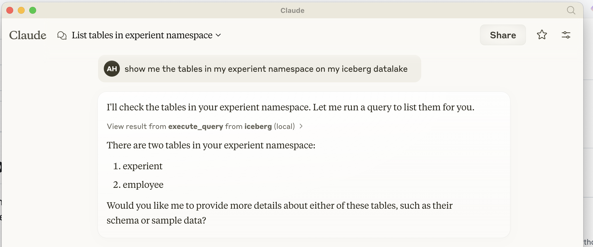

# MCP Iceberg Catalog

A MCP (Model Context Protocol) server to talk to your data in Iceberg format using an LLM, for example Claude.

## Claude Desktop as your Iceberg Data Lake browser


## How to Install in Claude Desktop


# Install

## Prerequisites
   - Python 3.10 or higher
   - UV package installer (recommended) or pip
   - Access to an Iceberg REST catalog and the corresponding lake storage (S3, ADLS...)


## Install procedure

At this time there is no packaging, sources are used

- Install Python dependencies with uv

First review the module dependencies in requirements.txt to match your case (AWS, Azure, GCP...)

Then install or update the dependencies

```python
uv add -r .\requirements.txt
```

- Setup connection to the Iceberg dictionary

Configure a catalog **named "iceberg"** and its access credentials using either .pyiceberg.yaml file or environment variables as explained in the [Pyiceberg documentation](https://py.iceberg.apache.org/configuration/)

- Basic check of the server startup

```python
uv run mcp-server-iceberg
```

You should get the INFO message "Starting server"

# How to configure in Claude Desktop
Add the following configuration to `claude_desktop_config.json`:

```json
{
  "mcpServers": {
    "iceberg": {
      "command": "uv",
      "args": [
        "--directory",
        "PATH_TO_/mcp-iceberg-service",
        "run",
        "mcp-server-iceberg"
      ]
    }
  }
}
```

## Design

### Architecture

The MCP server is built on three main components:

1. **MCP Protocol Handler**
   - Implements the Model Context Protocol for communication with Claude
   - Handles request/response cycles through stdio
   - Manages server lifecycle and initialization

2. **Query Processor**
   - Parses SQL queries using `sqlparse`
   - Supports operations:
     - LIST TABLES
     - DESCRIBE TABLE
     - SELECT (single table)
     - INSERT

3. **Iceberg Integration**
   - Uses `pyiceberg` in conjonction with `duckdb` for table operations
   - Manages catalog connections and table operations

### PyIceberg Integration

The server utilizes PyIceberg in several ways:

1. **Catalog Management**
   - Connects to REST catalogs
   - Manages table metadata
   - Handles namespace operations

2. **Data Operations**
   - Converts between PyIceberg and PyArrow types
   - Handles data insertion through PyArrow tables
   - Manages table schemas and field types

3. **Query Execution**
   - Basic integration between Pyiceberg and Duckdb through a full scan of the Iceberg table and in memory Arrow table
   - Manages result set conversion

## Further Implementation Needed

1. **Query Operations improvements**
   - [ ] Implement UPDATE operations
   - [ ] Add DELETE support
   - [ ] Support for CREATE TABLE with schema definition
   - [ ] Add ALTER TABLE operations
   - [ ] Implement table partitioning support

2. **Data Types improvements**
   - [ ] Support for complex types (arrays, maps, structs)
   - [ ] Add timestamp with timezone handling
   - [ ] Support for decimal types
   - [ ] Add nested field support

3. **Performance improvements**
   - [ ] Use Duckdb's Iceberg extension to avoid full scan
   - [ ] Implement batch inserts
   - [ ] Add query optimization
   - [ ] Support for parallel scans
   - [ ] Add caching layer for frequently accessed data

4. **Security improvements**
   - [ ] Add authentication mechanisms
   - [ ] Implement role-based access control
   - [ ] Add row-level security
   - [ ] Support for encrypted connections

5. **Monitoring and Management improvements**
   - [ ] Add metrics collection
   - [ ] Implement query logging
   - [ ] Add performance monitoring
   - [ ] Support for table maintenance operations

6. **Error Handling improvements**
   - [ ] Improve error messages
   - [ ] Add retry mechanisms for transient failures
   - [ ] Implement transaction support
   - [ ] Add data validation

